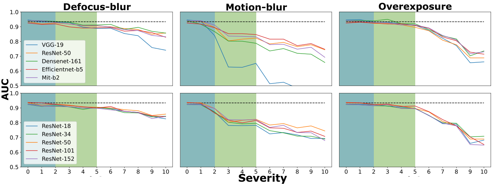
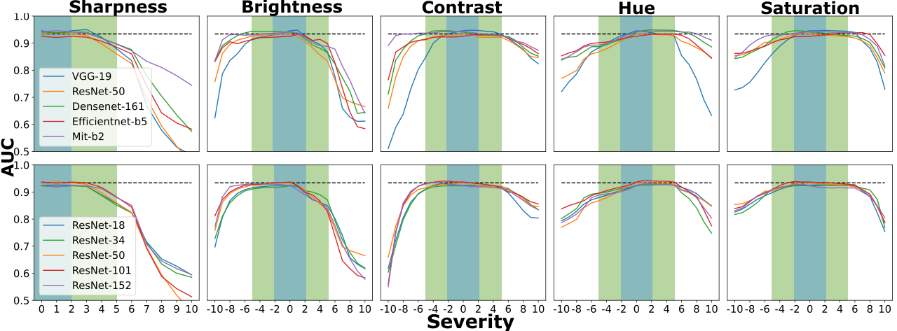
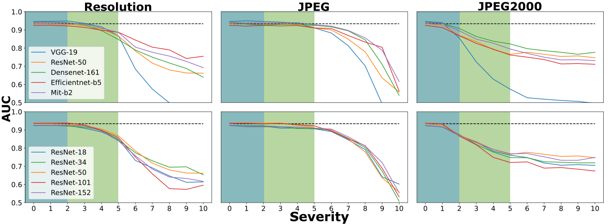

# Evaluating Robustness of Deep Neural Networks for Automated Cancer Detection in Endoscopy
ACCEPTED AT MICCAI 2023! \
\
This repository contains code used to create the robustness test set in the paper 'Evaluating Robustness of Deep Neural Networks for Automated Cancer Detection in Endoscopy'. The full paper can found in this [link]("aanpassen").
# Abstract
Virtually all endoscopic AI models are developed with clean, high-quality imagery from expert centers, but the clinical data quality is much more heterogeneous. Endoscopic image quality can degrade by e.g. poor lighting, motion blur, and image compression, which have a significant impact on the performance of DNNs. In order to find the limitations of DNNs and provide more robust models for automated cancer
detection, this work evaluates model performance under clinically relevant image degradations. Commonly-used DNN architectures are eval-
uated for various types of degradation, grouped in 3 categories: userdependent corruptions, image acquisition and processing changes, and
artifacts from compression. All corruption levels of severity were calibrated by two clinical research fellows. The results indicate that model
performance already decreases, within clinically relevant regions, up to 35%, 8%, and 40% for user-dependent, image acquisition and processing,
and compression, respectively. Our findings emphasize the significance of including robustness evaluation for DNNs used in endoscopy.

# Results

The following figures illustrate the impact of individual image degradations across varying severity levels.\
\

**Fig 1.** *Effects of user-dependent image degradation on model performance. The blue
areas indicate the levels of severity expected to be present in expert datasets, while the
green area indicates a clinically relevant amount of degradation. The black dotted line
highlights the reference performance of the ResNet-50 encoder on the original test set.*


**Fig 2.** *Effects of changes in image acquisition and processing on model performance.*


**Fig 3.** *Effects of changes in image acquisition and processing on model performance.*

## Installation
To clone the repository, use the following command:

```
git clone https://github.com/TimJaspers0801/Robustness.git
```
To install the required packages, navigate to the root directory of the repository and run the following command:

```
pip install -r requirements.txt
```
This will install all of the necessary packages listed in the requirements.txt file. Please also make sure you install the ImageMagicWand library:
https://imagemagick.org/script/download.php

## Create Robustness test set
The purpose of the robustness test set is created to evaluate endoscopic models using more heterogeneous data by 
incorporating the aforementioned corruptions. In the original paper, we included corruptions
up to severity level 5, as they are clinically calibrated and still realistic at that level. The paper revealed a performance drop of up to **14%** on the robustness test set.\
\
An other uption could be to only evaluated upto severity level 2, wich represent the amount of image degradation
expected in 'expert level' datasets. Alternatively, for those seeking to assess robustness in extreme scenarios, the evaluation could extend to severity levels 8, 9, and 10.\
\
To generate the Robustness test set, use the following command:

```
python create_robustness_set.py 'path/to/testset/images' path_masks='path/to/testset/Masks'  max_level=5, min_level=1 nb_iterations=5 include_compression=True
```
include the paths to masks if there are present. *nb_iterations* denotes the number of iterations the original test set is looped over.
In the original paper, the test set was corrupted a total of 5 times. The robustness after waiting for a while corrupted images can be found in the 'robustness test set' folder.


**Fig 4.** *Random examples included in the robustness test set.*


